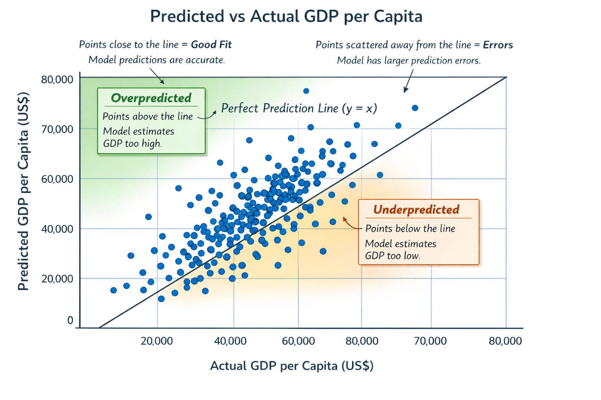

# Predicting Prosperity: What Drives a Country’s GDP?

*Using World Bank data, we explore how life expectancy, health expenditure, education, and inflation influence GDP per capita across countries, supported by predictive modeling and visualizations.*

---

## Introduction

GDP per capita is one of the most common measures of a country's economic wellbeing. But what factors influence it the most? Using World Bank data, we explored economic, health, and education indicators to predict GDP per capita across countries.

This blog explains our findings in a clear, non-technical way, supported by visualizations and analysis.

---

## Key Features That Matter

We looked at five main indicators in our model:

| Indicator | Effect on GDP per Capita |
|-----------|-------------------------|
| Life expectancy at birth | Positive — higher life expectancy tends to correlate with higher GDP |
| Health expenditure (% of GDP) | Positive — more spending on health generally relates to higher GDP |
| Population growth | Positive — in our model, higher population growth is associated with higher GDP |
| School enrollment (secondary) | Slight positive effect |
| Inflation (consumer prices) | Slight negative effect |

> These coefficients help us understand which factors most influence GDP per capita.

---

## Predicted vs Actual GDP

We built a model to predict GDP per capita using the indicators above.

The scatter plot above shows:

- **Points on the diagonal line:** perfect prediction  
- **Points above the line:** the model overestimates GDP  
- **Points below the line:** the model underestimates GDP  

Most countries are close to the line, meaning the model captures general trends well. Outliers indicate unique factors, like natural resources or small populations, that the model doesn’t capture.

---

## Creative Scenario: What If a Country Improves Its Indicators?

Suppose a country increases:

- School enrollment by 10%  
- Health expenditure by 5%  

Using our model, predicted GDP per capita would increase. This scenario demonstrates how improving education and healthcare can positively impact economic growth.

> Note: This is a simplified example. Real-world outcomes depend on many factors beyond these indicators.

---

## Conclusion

- Life expectancy, health expenditure, and population growth are the main drivers of GDP per capita in this dataset.  
- The scatter plot shows that while the model captures broad trends, extreme cases still exist due to unique country-specific factors.  
- Data-driven insights like this can help policymakers understand how improving social and economic indicators may support growth.

---

## Project Files

- [`Worldbank.ipynb`](Worldbank.ipynb) — full analysis, cleaning, and modeling  
- [`c538bed6-24d9-4d25-a075-11dc22bfe385_Data.csv`](c538bed6-24d9-4d25-a075-11dc22bfe385_Data.csv) — cleaned dataset  
- [`scatter_plot.png`](scatter_plot.png) — visualization of predicted vs actual GDP  

Explore the notebook and data directly in this repository.
